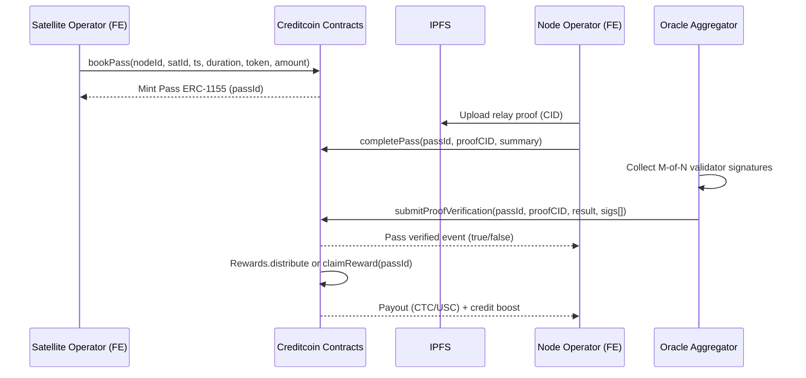
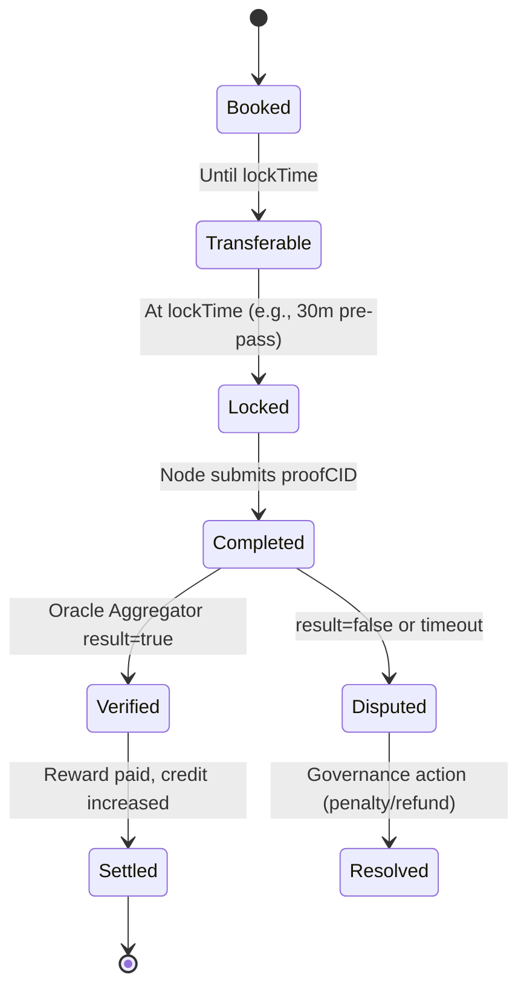

# SpaceLink — User Flows and System Architecture

This document maps all user-facing features to the on-chain backend (Creditcoin + optional ETH L2 periphery) and shows how the frontend experience connects to smart contracts and IPFS.

## Personas & Capabilities

- Satellite Operator
  - Register satellites (TLE + metadata)
  - Discover nodes and book passes (multi-token payments)
  - Manage/transfer pass NFTs prior to lock window
  - Monitor relay status and verification
  - Use BNPL (credit-based) to finance operations

- Ground Station (Node) Operator
  - Register node, stake (liquid sCTC)
  - Publish availability windows and capabilities (bands/specs)
  - Complete relays and upload proofs to IPFS
  - Claim rewards and build credit
  - Use BNPL with sCTC collateral

- Oracle Validator
  - Fetch/verify TLE and relay proof data off-chain
  - Sign attestations submitted to on-chain Oracle Aggregator

- Governance (Multi-sig)
  - Manage parameters: rewards, penalties, oracle validator set
  - Approve accepted tokens, staking/BNPL settings
  - Treasury operations

## Feature Matrix (High-Level)

- Registration: Nodes, Satellites (IPFS metadata + TLE)
- Pass Booking: ERC-1155 Pass NFT minted; transferable until lock window
- Relay Completion: Node submits proof CID; Oracle Aggregator verifies
- Rewards & Credit: Payout in CTC/USC; +credit on success; penalties via governance
- Payments: Multi-token via Payment Router + Token Registry
- Staking: Liquid staking (sCTC) for node operators, used as BNPL collateral
- BNPL Loans: Request/repay/liquidate; parameters governed by multi-sig
- Matching: On-chain discovery (view) by geo/uptime/bands/availability windows
- TLE Maintenance: Auto-updates via oracle validator set; freshness enforced

---

## End-to-End User Journeys

### 1) Node Operator Onboarding
1. Connect wallet → see credit score, sCTC balance
2. Stake CTC → receive sCTC receipt token
3. Register node with:
   - lat/lon (scaled), specs, uptime, IPFS CID (photos/spec JSON)
   - lock minimum sCTC as registration stake
4. Add availability windows (start/end timestamps)
5. Go live → bookings can be received

### 2) Satellite Operator Flow
1. Connect wallet → view current credit and BNPL eligibility
2. Register satellite with TLE1/TLE2 and IPFS metadata
3. Find nodes using on-chain filters (geo-box, uptime, bands, time window)
4. Book pass:
   - Select token (CTC/USC/allowlisted)
   - Pay via Payment Router
   - Receive ERC-1155 Pass NFT
5. Optionally transfer/sell Pass NFT before lock window
6. Monitor relay, wait for verification and settlement

### 3) Booking → Verification → Settlement (Sequence)


### 4) Pass Resale Flow
1. Operator lists Pass NFT on Pass Exchange with price/token
2. Buyer purchases before lockTime
3. Ownership transfers; booking rights follow NFT owner
4. Marketplace enforces non-transferability inside lock window

### 5) BNPL Loan Flow (Sequence)
```mermaid
sequenceDiagram
    participant User as Operator (FE)
    participant LM as BNPL Loan Manager
    participant ST as Liquid Staking (sCTC)
    participant TR as Treasury

    User->>ST: depositCTC(amount) → mint sCTC
    User->>LM: requestLoan(amount, token, collateral=sCTC)
    LM->>LM: Check credit score, LTV, thresholds
    LM->>TR: Disburse loan (USC/CTC)
    TR-->>User: Funds received

    User->>LM: repayLoan(loanId, amount)
    LM->>ST: unlock/reduce collateral
    LM-->>User: Loan closed; sCTC free
```

### 6) TLE Update & Validation Flow
1. Validators fetch latest TLE
2. Each signs the TLE payload with expiry
3. Oracle Aggregator verifies M-of-N signatures on-chain and updates cache
4. Marketplace enforces TLE freshness during booking and completion

---

## Pass Lifecycle (State Machine)


---

## System Architecture (Multi-Chain)
```mermaid
flowchart LR
    subgraph FE[Frontend (Next.js + Wallet)]
      FE1[Wallet Connect]
      FE2[IPFS Upload]
      FE3[Read Views & Event Subscriptions]
    end

    subgraph CC[Creditcoin Chain]
      MK[Marketplace]
      RW[Rewards]
      CR[Credit Adapter]
      LM[BNPL Loan Manager]
      LS[Liquid Staking (sCTC)]
      PR[Payment Router]
      TRG[Token Registry]
      OA[Oracle Aggregator]
      IPF[IPFS Adapter]
    end

    subgraph L2[ETH L2 (Optional Periphery)]
      CL[Chainlink Functions Jobs]
      PO[Price Oracle]
    end

    IPFS[(IPFS Network)]
    MS[Governance (Gnosis Safe)]
    TS[Treasury]

    FE2 -- CID --> IPFS
    FE1 -- tx/calls --> CC
    FE3 -- views/events --> CC

    MK <--> PR
    PR <--> TRG
    MK <--> RW
    MK <--> CR
    MK <--> OA
    MK <--> IPF

    LM <--> LS
    LM <--> TS
    RW <--> CR

    CL -- signed payloads --> OA
    PO -- prices/rates --> PR

    MS -- admin --> MK & RW & CR & LM & LS & PR & TRG & OA
```

---

## Frontend Interaction Map (No Central Backend)

Pages / Modules and their on-chain interactions:

- Dashboard
  - Reads: credit score, relays completed, active loans, sCTC balance
  - Events: recent passes, rewards claimed

- Nodes
  - Actions: registerNode, setNodeAvailability, deactivate
  - Reads: node details, availability windows, bookings
  - IPFS: upload station metadata/photos → CID

- Satellites
  - Actions: registerSatellite
  - Reads: satellites, TLE freshness
  - IPFS: upload satellite metadata → CID

- Discover/Book
  - Reads: getAvailableNodes(params, cursor, limit)
  - Actions: bookPass(nodeId, satId, timestamp, duration, token, amount)
  - Token: choose via Payment Router (CTC/USC/allowlisted)

- Passes
  - Reads: pass list, tokenURI metadata (IPFS), state (Booked/Locked/...)
  - Actions: transfer (pre-lock), view proofs/summary after completion

- Marketplace (Pass Exchange)
  - Actions: list/cancel/buy pass

- Relays
  - Node-only: completePass(passId, proofCID, summaryMetrics)
  - IPFS: upload proof & logs → CID

- Rewards
  - Actions: claimReward (if not auto-distributed)
  - Reads: rewardsEarned, relayCount

- Staking
  - Actions: depositCTC → sCTC, withdrawCTC
  - Reads: exchangeRate, sCTC balance

- Loans (BNPL)
  - Actions: requestLoan, repayLoan
  - Reads: eligibility, active loans, collateral status

- Settings
  - Reads: accepted tokens, reward token, governance-configured params

Implementation notes:
- Use on-chain reads with pagination for discovery; avoid centralized indexers; optional community-run indexers can improve UX later
- IPFS uploads happen client-side; only CIDs are sent to contracts
- Wallet flows via standard libraries (wagmi/ethers). No custom backend required

---

## Edge Cases & UX Safeguards

- Insufficient balance/allowance → prompt token selection and approval via Payment Router
- Stale TLE → prevent booking; show update prompt to satellite owner
- Pass lock window → disable transfer UI and warn on timing
- Oracle pending → show verification pending state with countdown; allow notifications
- Collateral shortfall → show health factor, repay/top-up prompts; liquidation warnings

---

## Success Metrics (UX)

- < 3 clicks to book a pass (after connect)
- < 2 minutes median verification time
- > 95% clarity: users can see state, next action, and timers
- > 80% successful bookings reach settlement
